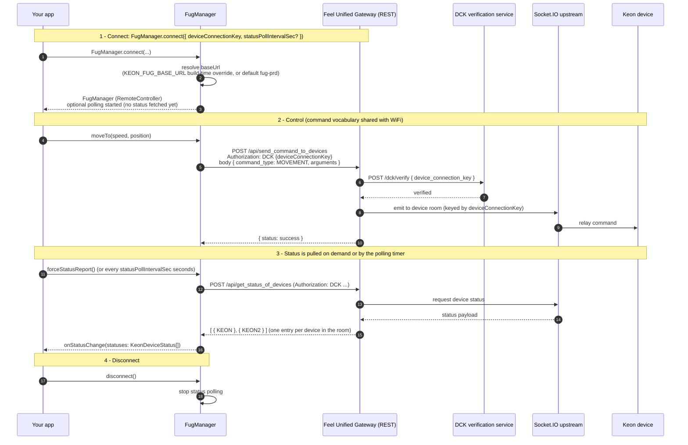

# FUG transport flow (REST)

The Feel Unified Gateway (FUG) exposes the **same command vocabulary** as the
Socket.IO channel, but over a plain REST API. `FugManager` is the transport for
this channel; like `WifiManager` it implements `RemoteController`, so the
control code is interchangeable.

Two things make FUG different from the WiFi transport:

- **Authentication is the device connection key.** There is no JWT/Bearer — each
  request carries `Authorization: DCK {deviceConnectionKey}`. The gateway
  verifies the key, then relays the command to the device through its own
  Socket.IO upstream.
- **Status is pulled, not pushed.** REST has no server-initiated events, so
  status arrives only on demand (`forceStatusReport()`) or on a timer
  (`statusPollIntervalSec`, default 30s; `0` disables it). `connect` itself does
  not fetch — call `forceStatusReport()` afterwards for the initial status.

## What each phase does

1. **Connect** — `FugManager.connect({ deviceConnectionKey, … })` resolves the
   base URL (the `KEON_FUG_BASE_URL` build-time env override, or the default
   production gateway) and, unless `statusPollIntervalSec` is `0`, starts a
   polling timer (default 30s). It does not fetch status itself — call
   `forceStatusReport()` afterwards for the initial state.
2. **Control** — each command is a `POST /api/<event>` with the
   `Authorization: DCK {deviceConnectionKey}` header and the same JSON body the
   WiFi transport emits. The gateway verifies the key against the DCK
   verification service, then relays the command over its Socket.IO upstream to
   the device.
3. **Status (pull)** — call `forceStatusReport()` to fetch the latest status, or
   rely on the optional polling timer. Either way the SDK delivers the full
   device list through `onStatusChange(statuses: KeonDeviceStatus[])`.
   `getStatus()` returns the primary (first reported) device, and
   `getStatuses()` returns the full list.
4. **Disconnect** — `disconnect()` stops the polling timer (there is no socket to
   close).
