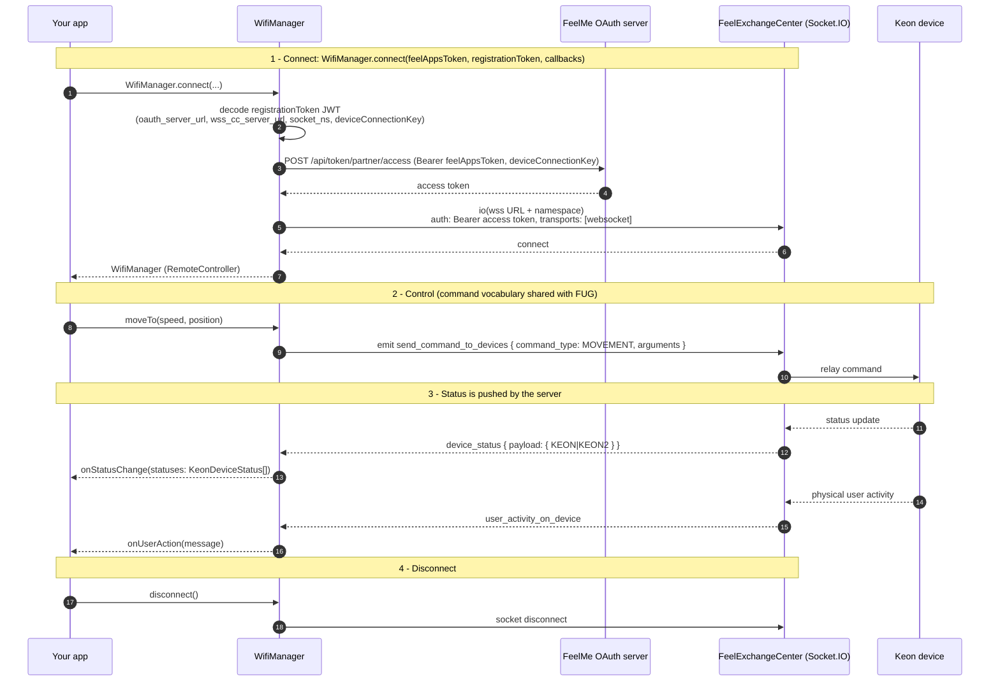

# WiFi transport flow (Socket.IO)

Once a device is set up it talks to the FeelExchangeCenter (FEC) over a
persistent **Socket.IO** connection. `WifiManager` is the transport for this
channel; it implements the common `KeonController` interface plus the
`RemoteController` settings methods, so control code is identical whether you
later switch to the FUG transport.

The defining trait of this transport is that **status is pushed**: the server
emits `device_status` events as devices report, and the SDK forwards the current
status list to your `onStatusChange(statuses: KeonDeviceStatus[])` callback —
no polling needed.

## What each phase does

1. **Connect** — `WifiManager.connect(feelAppsToken, registrationToken, …)`
   decodes the registration token to find the WebSocket server URL, namespace
   and `deviceConnectionKey`, exchanges the partner token for an access token,
   then opens the Socket.IO connection (WebSocket transport only, `Bearer`
   auth). Throws `AuthError` if credentials cannot be obtained.
2. **Control** — `moveTo`, `movementBetween`, `stop`, plus the
   `RemoteController` settings (`setIntensity`, `setStatusInterval`,
   `switchToBtMode`, `resetCredentials`, `forceStatusReport`) are emitted as
   JSON `send_command_to_devices` / `send_settings_to_device` /
   `send_reprovision_command_to_device` events. The exact same command
   vocabulary is reused by the FUG transport.
3. **Status (push)** — the server forwards `device_status`
   (`payload.KEON` / `payload.KEON2`) as they happen. The SDK merges each device
   report into the current status list and calls
   `onStatusChange(statuses: KeonDeviceStatus[])`. `getStatus()` returns the
   primary (first reported) device, and `getStatuses()` returns the full list.
4. **Disconnect** — `disconnect()` closes the socket.
